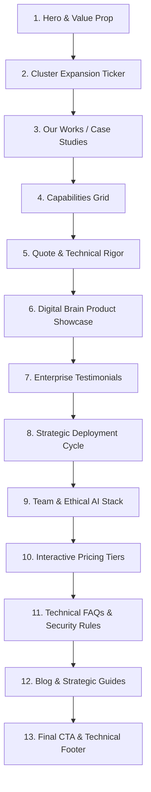

# Spartan AI - Design System & Visual Architecture Analysis

A comprehensive design review of the **Spartan AI Framer Template** (developed by Delani.pro). This document breaks down the visual aesthetics, structural layouts, typographic systems, color palettes, and UX philosophies that define this enterprise-grade AI agency template.

---

## 1. Executive Summary & Design Philosophy
The **Spartan AI** template represents a significant shift from common "startup" SaaS designs (characterized by soft pastel colors, friendly illustrations, and sparse text) toward a **"black-box" industrial-grade technical aesthetic**. 

It is engineered specifically for:
*   AI research labs
*   Neural engineering consultancies
*   Enterprise-facing AI automation studios
*   High-end technical agencies

The visual theme communicates **authority, data sovereignty, and high-performance computing** to build trust with enterprise buyers (e.g., CTOs, VPs of Engineering) who make high-ticket purchasing decisions ($10k–$100k+ contract sizes).

---

## 2. Color Palette & Visual Theme
The design is built on a dark mode-first, modular design framework.

```
+--------------------------------------------------------------+
| Base: Dark Charcoal/Rich Black (#0B0B0C / #000000)           |
+--------------------------------------------------------------+
| Accents: Technical Monospace Grey, Subtle Neon/Slate Glows  |
+--------------------------------------------------------------+
| Borders: High-contrast grid lines & frosted glass panels     |
+--------------------------------------------------------------+
```

### Visual Styling Elements
*   **Mesh Gradients:** Deep, dark, or semi-translucent mesh gradients behind cards to simulate "glowing neural nodes" or computational engines.
*   **Frosted Glassmorphism:** High-end backdrop filters (`backdrop-filter: blur()`) on headers, dropdowns, and cards, projecting a premium look.
*   **Industrial Grid Layouts:** Explicit borders (`border-color` using low-opacity white/grey) separating columns and sections, mirroring the structure of technical blueprints or server racks.
*   **Clean Technical Accents:** Muted badges, slashes (`//`), line numbers, and version controls (e.g., `// Model v4.0.2`) to emphasize precision.

---

## 3. Typographic System & Hierarchy
Spartan AI utilizes a sophisticated, high-contrast, multi-family font system:

| Font Family | Usage | Psychological Impact |
| :--- | :--- | :--- |
| **PP Editorial New** | Serif editorial headers and quotes | Conveys academic depth, research credibility, and prestige. |
| **Inter & Inter Display** | Main body copy, navigational links, primary labels | Modern, clean, and highly readable across all screen sizes. |
| **Geist Mono / IBM Plex Mono** | Line prefixes (`// 01`), system versioning, technical badges | Establishes a "developer-first", machine-level technical feel. |
| **Helvetica Rounded Bold** | Alternative high-impact headings | Strong, modern visual impact. |

### Typography Scale (Example Pairings)
*   **Hero H1:** Large `Inter Display` or `Helvetica Rounded Bold` (e.g., `Scale your ideas. Build with AI.`) paired with serif details or code annotations.
*   **Section Headers:** `Inter Display` for structural titles with `Geist Mono` taglines above them.
*   **Quote blocks:** `PP Editorial New Regular` for high-impact statements from founders or clients.

---

## 4. Structure & Detailed Page Layout
The homepage is structured as a progression designed to convert enterprise stakeholders by addressing their core concerns: competence, security, process, and scalability.



### Page Sections Analysis

#### 1. Hero Section
*   **Visuals:** High-contrast text overlays, interactive call-to-actions, and version annotations (e.g., `Digital Brain // Model v4.0.2`).
*   **Social Proof:** Mentions `+2,400 active deployments` and `8,200 brands` right beneath the main headline.
*   **Metric Highlight:** Large numerals for active agents (e.g., `15,400`) and client revenue generated.

#### 2. Announcement Ticker
*   A custom scrolling ticker introducing recent infrastructure changes: `//SPARTAN: We are officially expanding our neural compute clusters... providing sub-50ms inference speeds...`
*   **Purpose:** Reinforces the idea that Spartan is a real-time infrastructure provider rather than just a design wrapper.

#### 3. Case Studies (Our Works)
*   **Metric-Driven Grid:** Replaces qualitative descriptions with concrete ROI statistics:
    *   *Funds raised* (e.g., `$45M+`, `$62M+`, `$94M+`)
    *   *ATH ROI* (e.g., `41x`, `73x`)
    *   *Social growth / Partnerships* (e.g., `700%`, `84 Partnerships`)
*   **Layout:** Interactive cards that highlight the specific industry verticals (Healthcare AI, Retail & Logistics, Cybersecurity).

#### 4. Capabilities (Services)
*   **Tagline:** *"We bridge the gap between abstract machine learning and practical business utility through bespoke engineering."*
*   **Cards:** Clean, bordered panels indexing services using `001`, `002`, `003` prefix numbering:
    *   `001: Autonomous Agent Architecture Labs` (describing local LLMs and secure hosting)
    *   `002: Autonomous Agentic Workflows`
    *   `003: Data Pipelines & RAG Systems`

#### 5. Founder's Vision
*   Features a premium, editorial quote by *Alexander Vacca (Founder & Lead Engineer)*: *"By merging technical rigor with intuitive design, we build systems that don't just solve problems—they create entirely new opportunities for growth."*
*   Contrasts serif typography with structured, all-caps monospace accents.

#### 6. "Digital Brain v4.0.2" Product Showcase
*   A dedicated visual layout highlighting product features:
    *   Semantic vector search for hyper-accurate retrieval.
    *   Unified data lakes for expansive model context.
    *   Token-optimized flows for high-speed processing.
    *   Support for 95+ languages (ZH, HI, ES, FR, AR, BN, PT, RU, EN, DE).

#### 7. Testimonials Grid
*   Highlights real enterprise buyer profiles (CTOs, Head of AI, Lead Devs at major companies like Aetna, Cigna, Anthem Group).
*   Focuses on performance metrics like *"reduced support tickets by 80%"* and *"reduced manual data entry by 90%"*.

#### 8. Process (Iterative Deployment Cycle)
*   A chronological 4-step sequence:
    1.  `// 01 Audit` (Comprehensive Strategic Audit)
    2.  `// 02 Custom Architecture Design`
    3.  `// 03 Rapid Prototype Development`
    4.  `// 04 Enterprise Scale Deployment`
*   **Design Element:** High-contrast step indicators with thick borders to emphasize a linear, reliable methodology.

#### 9. Team & Ethical AI
*   Highlights the internal collective (Sarah Jenkins - Head of ML, Marcus Cheng - Design Director, Elena Vance - Cognitive Scientist, David Rossi - Infrastructure).
*   Each card features a quote emphasizing specific operational values, such as ethical deployment, cognitive alignment, and latency optimization.

#### 10. Interactive Pricing Tiers
*   **Tiers:**
    *   **Core ($495/mo):** Ideal for basic automation flows, 1 admin seat, and RAG support.
    *   **Growth ($1,250/mo):** Adds vector DB hosting and 5 admin seats.
    *   **Pro ($2,900/mo):** Adds custom fine-tuning and 15 admin seats.
    *   **Scale ($7,500/mo):** Enterprise on-premise LLMs, dedicated engineer, and unlimited seats.
*   **Design:** Side-by-side card layouts with a Monthly/Annually toggle showing a "Save 20%" badge.

#### 11. Technical FAQs
*   Answers high-value sales questions directly: *How do you ensure data is secure? What is the deployment timeline? Do we own the code?*
*   Addresses SOC2 compliance, private LLM hosting, and vector database safety to eliminate friction during enterprise vetting.

#### 12. Insights & Content Marketing
*   High-impact blog listing emphasizing modern technical concepts:
    *   *The Sovereign Cloud: Why On-Premise AI is the Future of Data Privacy*
    *   *The Architecture of Autonomy: Scaling AI Within Legacy Frameworks*
    *   *Human-Centric Automation: Designing AI That Empowers Your Workforce*

---

## 5. Micro-interactions & Usability Design
To keep the data-dense layouts engaging, Spartan AI implements a series of high-quality UI micro-interactions:
1.  **Header Blur & Reveal:** As the user scrolls, the header applies a glassmorphic blur backdrop to remain readable over various sections.
2.  **Card Border Highlights:** Cards light up with soft, glowing borders or gradient changes upon hovering.
3.  **Continuous Horizontal Tickers:** Announcement bars and partner logos scroll smoothly without jumpy animations, maintaining a calm, technical rhythm.
4.  **Tab & Toggle Animations:** Seamless slide transitions when toggling pricing options (Monthly vs. Billed Annually).

---

## 6. Key Design Takeaways for Custom Rebuilds
For anyone using Spartan AI as inspiration or rebuilding a similar interface:
*   **Avoid Generic Gradients:** Use deep slate, charcoal, and dark indigo base tones instead of saturated violet/pink gradients.
*   **Keep Typography Technical:** Pair clean sans-serif text with monospaced tags and serif statements.
*   **Emphasize Metrics & ROI:** Do not just list features. Clearly showcase funds raised, latency speeds, and ROI metrics.
*   **Address Enterprise Barriers Early:** Highlight security measures (SOC2, private cloud, local LLMs) as core design elements rather than hiding them in footer links.
